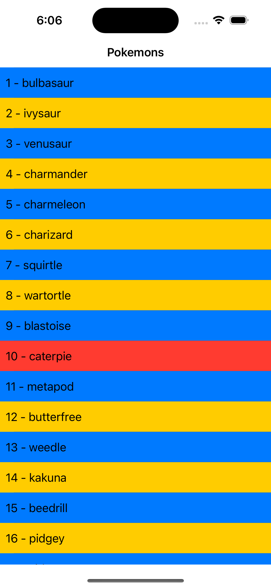

# Interview for iOS

## Introdução:
Antes de começar, algumas regras precisam ser seguidas:
* O desafio deverá ser feito em Swift
* A construção deverá ser feita apenas em ViewCode
* Não é permitido o uso de bibliotecas terceiras
* O código deverá seguir a arquitetura MVVM
* Se atente nas regras de negócio descritas

Neste repo, você encontrará um projeto pré-pronto para iniciar o desafio, onde mexerá em duas controllers `MainViewController` e `DetailViewController` nas quais serão onde haverá as modificações (descritas mais abaixo).

O desafio consiste em criar duas telas simples, preenchendo o contéudo com o consumo de uma API, que neste caso, será a de [Pokémon](https://pokeapi.co/docs/v2).

Comece realizando um fork deste repositório para sua conta, realize as modificações e abra um Pull Request de volta para que seja analisado. Adicione informações na descrição do PR caso você queira explicar algo relevante.

*Não é necessário ter um MAC para o desafio, faça em um editor online ou no próprio VSCode do Windows caso queira!*

## 1. MainViewController



1.
    1. Deverá utilizar uma UITableView em toda a tela.
    2. Ao entrar na tela, deverá fazer uma requisição que preencha esta UITableView, requisição GET da rota `https://pokeapi.co/api/v2/pokemon/`.
    ```
    {
        "results": [
            {
                "name": "bulbasaur",
                "url": "https://pokeapi.co/api/v2/pokemon/1/"
            },
            {
                "name": "charmander",
                "url": "https://pokeapi.co/api/v2/pokemon/4/"
            },
            {
                "name": "squirtle",
                "url": "https://pokeapi.co/api/v2/pokemon/7/"
            }
        ]
    }
    ```
    3. Ao realizar o parse e colocar na UITableView, é necessário que mostre no formato `Index - Nome`, onde **Index** é a posição do item que voltou na requisição e o **Nome** é o campo `name`.
    4. Cada item da lista deverá ser colorido. Onde:
        1. Se seu `Index` for impar, o seu background deverá ser `blue`.
        2. Se seu `Index` for par e multiplo de 10, o seu background deverá ser `red`.
        3. Se seu `Index` for par e não é multiplo de 10, o seu background deverá ser `yellow`.
        <br/>
        <br/>
        Obs: Adapte a cor do texto se necessário para estar legível na tabela.
    5. Ao clicar no item da UITableView, deverá abrir a `DetailViewController` passando o campo `url` da primeira requisição feita do item clicado.

## 2. DetailViewController


2.
    1. Ao entrar na tela deverá fazer uma requisição que traga as informações do pokémon, realizando uma requisição GET utilizando a `url` que foi passada da tela anterior. Ex: Se eu clicar no `1 - bulbasaur`, deveria fazer a requisição para `https://pokeapi.co/api/v2/pokemon/1/`.
    2. Após ter os dados, deve ser preenchido os campos na tela com os dados que vieram da API (Para o caso acima, este seria o JSON).
    ```
    {
        "id": 1,
        "height": 7,
        "name": "bulbasaur",
        "weight": 69
    }
    ```
    3. Preencha a imagem da tela com o seguinte critério:
        1. Se o campo `id` for impar e não é multiplo de 5, a imagem deverá utilizar o asset `bulbasaur`.
        2. Se o campo `id` for impar e é multiplo de 5, a imagem deverá utilizar o asset `charmander`.
        3. Se o campo `id` for par e não for ímpar, a imagem deverá utilizar o asset `squirtle`.
    4. O nome deve ser sempre com a primeira letra maiúscula.
    5. Implemente acessibilidade na imagem, deverá ser lido como um `botão` e seu texto deverá ser utilizado o campo `name`.
    6. Implemente acessibilidade no clique do botão de navegação voltar, deverá ser anunciado que a tela está fechando (Seja criativo no texto)!

## Desejáveis:
* Adicione testes unitários quando possível usando XCTest.
* Melhore o que você já fez, complemente com os estados de loading e erro.
* Salve a primeira requisição em um cache, ao fechar e abrir o aplicativo, verifique se existe algo no cache antes de fazer a requisição, caso houver use este dado, caso não prossiga com a requisição.